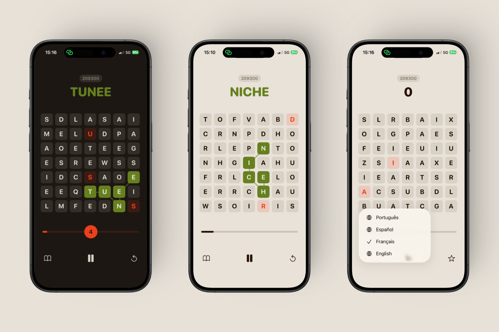

<p align="center">
  
</p>

# Capelo

A fast-paced word game (Boggle-style) built entirely in Swift and SwiftUI.

Swipe across a 7×7 letter grid to form words, trigger bomb chain reactions, and race against the clock. The grid refills endlessly — the only limit is the timer.

## Features

- Drag-to-select in all 8 directions with backtrack support
- Bombs spawn from 4+ letter words with 3×3 chain explosions
- Timed gameplay with time bonuses scaling with word length
- 4 languages: English, French, Spanish, Portuguese
- Built-in word definitions via Wiktionary
- Online leaderboard (best score per player)
- Haptic feedback

## Tech

- Swift / SwiftUI — iOS 26.2+
- Cloudflare Workers + D1 for the leaderboard API
- Zero third-party dependencies on the client (URLSession + CryptoKit)

## Setup

The app requires a `Capelo/Secrets.swift` file (gitignored) for HMAC request signing:

```swift
enum Secrets {
    static let hmacKey = "your_hmac_secret_here"
}
```

## License

MIT License — see [LICENSE](LICENSE) for details.

---

[Support](support/SUPPORT.md) | [Privacy Policy](support/PRIVACY.md) | [Terms of Service](support/TERMS.md)

Personal project by [@cassardp](https://github.com/cassardp).
